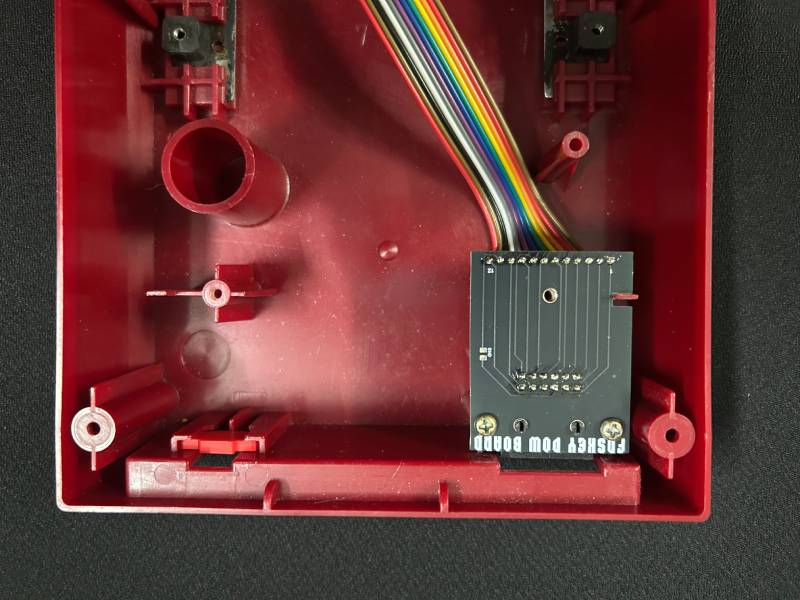
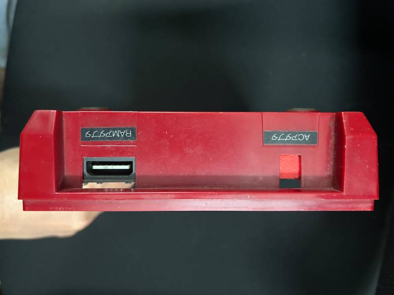
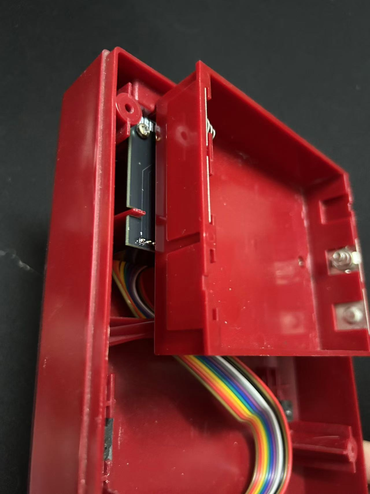
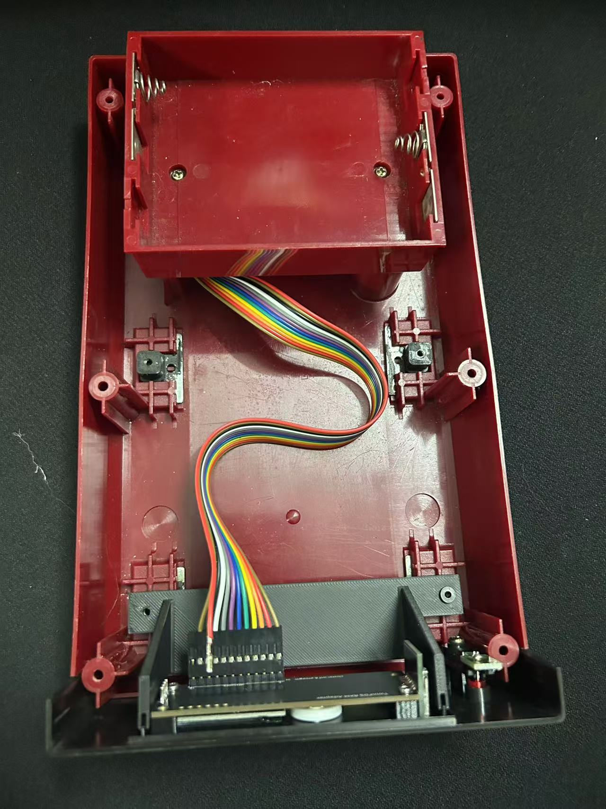
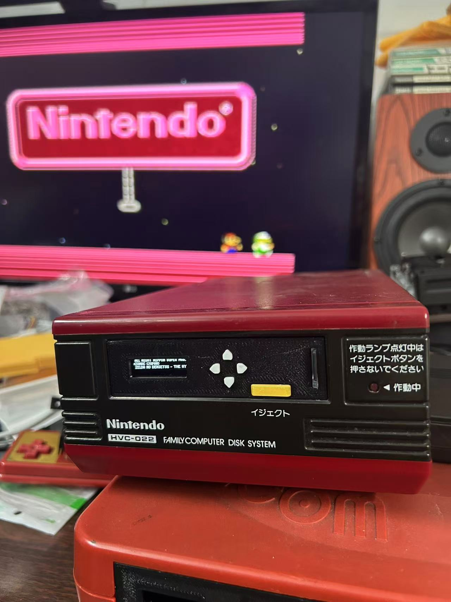

# FDSKey 磁碟机套件安装说明
（查看[繁体中文版](README_CHT.md)）

## 1. 产品简介
任天堂磁碟机仿真器FDSKey磁碟机面板版安装说明。

本产品适用**任天堂磁碟机**型号 `HVC 022`。

---

## 2. 套件清单
套件包括以下物品：

- FDSKey 模块 × 1  
- 支架 × 1
- 30CM 12P 排线 × 1
- 电源板 × 1
- DC 挡板 x 1
- Diskun 贴纸 x 1
- 螺丝 × 2

---

## 3. 安全须知
在安装前，请务必阅读以下安全提示：
- 确保电源已关闭，拔掉电源线。

---

## 4. 安装步骤

### 4.1 准备工作
- 准备安装所需的工具（十字螺丝刀）。

### 4.2 安装步骤
1. **拆开磁碟机螺丝**：  
   拆掉底部 4 颗螺丝即可打开上盖。
   
2. **拆除电池盒**：  
   拆掉 2 颗螺丝后将电池盒拿出。

3. **拆除原电源板**：  
   将与磁碟机连接的排线拔掉再取出。

4. **拆除磁碟机**：  
   拆掉 4 颗固定脚垫的螺丝即可拿出。

5. **安装电源板**：

   如图所示装上电源板，注意要插上`排线`再安装。
   

6. **安装 DC 口挡板**：

   安装完后的后视图。
   
   

7. 安装电池盒：

   

8. 安装支架：

   使用配带的螺丝将支架安装上，参考下图。
   
   

9. 安装**FDSKey模块**：

   将带有面板的`FDSkey模块`放上支架，如下图所示。
   

10. **测试**：
   - 插上带有游戏的内存卡到FDSKey面板的内存卡插槽，内存卡的Logo面朝右。
   - 将`RAM适配器`的线接上后面的电源板接口。
   - 打开插上`RAM适配器`的FC主机进行测试。

11. 最后：
   - 安装外壳螺丝固定。
   - 帖上 `Diskun 贴纸`。
   

---

## 5. 常见问题与解决方法
### 问题1：设备无法启动  
**解决方法**：  
- 确认电源连接是否正确。  
- 检查电源是否正常工作。

### 问题2：屏不亮  
**解决方法**：  
- 确认设备安装位置是否符合要求。  
- 联系售后服务。

---

## 6. 技术支持
如果您在安装或使用过程中遇到问题，请通过以下方式联系我们：  
- 欢迎提 [`issue`](https://github.com/retrodiy/fdskey-disk-ver/issues)。

---

## 7. 注意事项
- 请勿私自拆卸产品，避免影响保修服务。
- 本产品仅限室内/室外使用（根据具体情况填写）。
