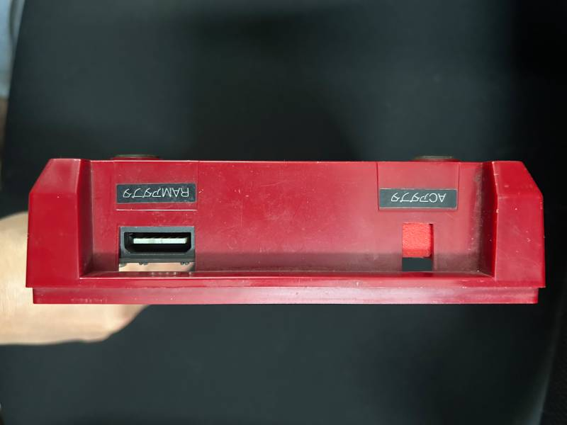
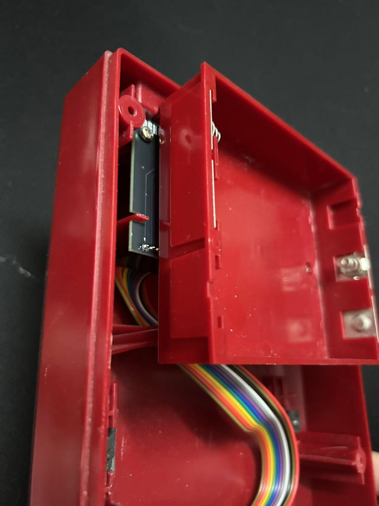
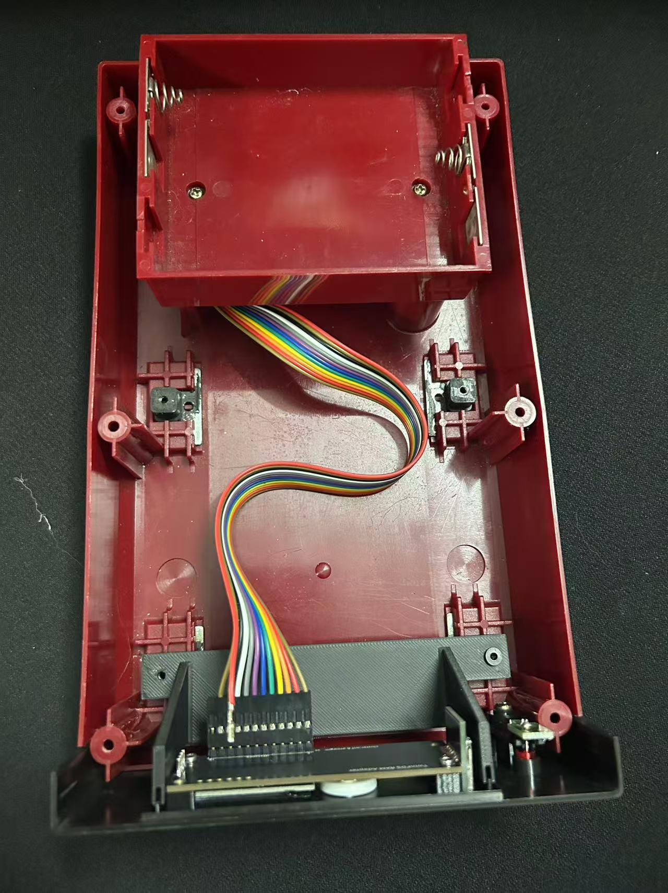

# FDSKey 磁碟機套件安裝說明

（查看[簡體中文版](README.md)）

## 1. 產品簡介

任天堂磁碟機模擬器 FDSKey 磁碟機面板版安裝說明。

本產品適用於 **任天堂磁碟機** 型號 `HVC 022`。

---

## 2. 套件清單

套件包括以下物品：

- FDSKey 模組 × 1  
- 支架 × 1  
- 30CM 12P 排線 × 1  
- 電源板 × 1  
- DC 擋板 × 1  
- Diskun 貼紙 × 1  
- 螺絲 × 2  

---

## 3. 安全須知

在安裝前，請務必閱讀以下安全提示：

- 確保電源已關閉，並拔掉電源線。

---

## 4. 安裝步驟

### 4.1 準備工作

- 準備安裝所需的工具（十字螺絲起子）。

### 4.2 安裝步驟

1. **拆開磁碟機螺絲**：  
   拆掉底部 4 顆螺絲即可打開上蓋。

1. **拆除電池盒**：  
   拆掉 2 顆螺絲後將電池盒取出。

1. **拆除原電源板**：  
   將與磁碟機連接的排線拔掉再取出。

1. **拆除磁碟機**：  
   拆掉 4 顆固定腳墊的螺絲即可取出。

1. **安裝電源板**：  

   如圖所示裝上電源板，注意按**編號**插上`排線`再安裝。

   

1. **安裝 DC 口擋板**：

   安裝完成後的後視圖。  

   

1. **安裝電池盒**：  
   

1. **安裝支架**：  

   使用配備的螺絲將支架安裝上，參考下圖。  
   

1. **安裝 FDSKey 模組**：  

   - 將帶有面板的 FDSKey 模組放上支架，如上圖所示。  
   - 按對應的**編號**插上`排線`。

1. **測試**：  

    - 將帶有遊戲的記憶卡插入 FDSKey 面板的記憶卡插槽，記憶卡的 Logo 面朝右。  
    - 將 `RAM 適配器` 的線接上後方的電源板介面。  
    - 打開插上 `RAM 適配器` 的 FC 主機進行測試。

1. **最後**：  

    - 安裝外殼螺絲進行固定。  
    - 貼上 `Diskun 貼紙`。
   

---

## 5. 常見問題與解決方法

### 問題 1：設備無法啟動

**解決方法**：
- 確認電源連接是否正確。
- 檢查電源是否正常工作。

### 問題 2：螢幕不亮

**解決方法**：  
- 確認設備安裝位置是否符合要求。  
- 聯繫售後服務。

---

## 6. 技術支持

如果您在安裝或使用過程中遇到問題，請通過以下方式聯繫我們：  
- 歡迎提交 [`issue`](https://github.com/retrodiy/fdskey-disk-ver/issues)。

---

## 7. 注意事項

- 請勿私自拆卸產品，避免影響保固服務。  
- 本產品僅限於室內/室外使用（根據具體情況填寫）。
